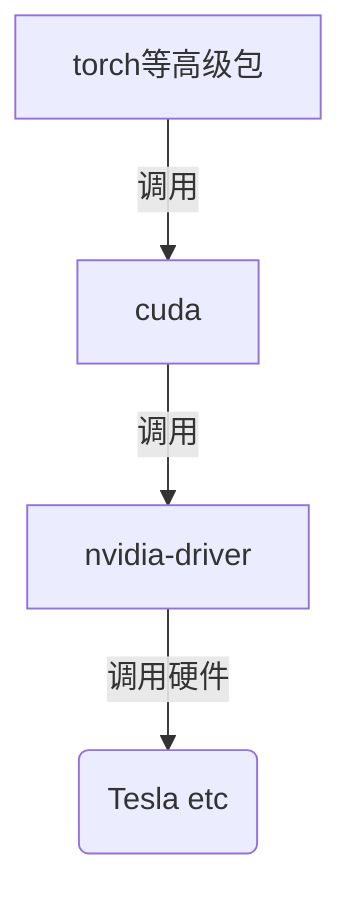

### SSH免密登录

1. 本地``.ssh/config``中配置相关账号端口信息
1. 将公钥写到远程主机：``ssh-copy-id username@ip``


### GPU环境配置

1. conda创建环境：``conda create -n py36 python=3.6``
1. 安装torch以及transformers等包，推荐使用可复用的``install.sh``脚本离线统一配置


### Docker 开发

#### docker编译流程

1. 指定操作系统，如ubuntu等: ``From ubuntu ...``
1. 安装必要的一些工具: ``Run apt-get...``, `` Run wget...``
1. 复制项目文件(包括模型等)到docker中: ``copy ./* -> ./``
1. 安装项目所需工具和包: ``pip install -r requriment.txt``
1. 指定docker运行时的命令(启动时执行./entrypoint.sh ...): ``command [...]``


####  cuda

1. 基于C++的调用底层驱动包
2. 结构图



#### conda

1. 结构上是python+环境管理的包(conda)
2. anaconda在conda基础上添加了numpy、jupyter等科学计算的包


### Tmux

推荐博客：[Tmux使用手册][1]

优势：对比nohup，tmux有其独到的优势，如能够同时开多个后台运行程序等


### 常用命令

开发中常用到的几个命令和踩坑，在此贴一下

```bash
# 新建会话
tmux new -s demo

# 关闭会话
tmux kill-session -t demo

# 进入会话
tmux a -t demo

# tmux内使用滚动：Ctrl + b，键入set -g mouse on
# tmux内使用选中复制：按住alt再选中即可复制选中内容
```


[1]: http://louiszhai.github.io/2017/09/30/tmux "Tmux"